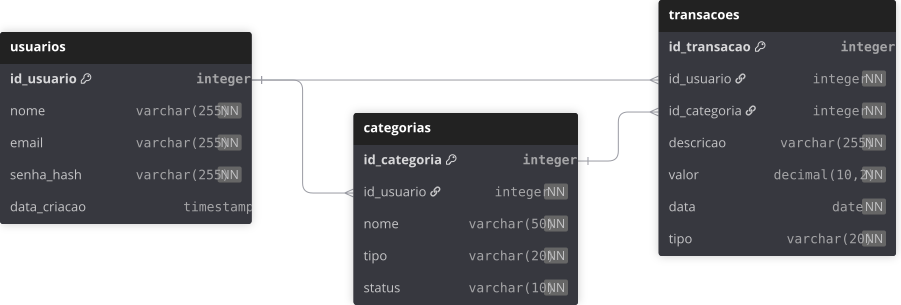

# Apresentação do Dashboard Financeiro

## Tecnologias Utilizadas

### Frontend
- **React.js (Vite)**: Framework para interfaces dinâmicas e rápidas.
- **Tailwind CSS**: Estilização utilitária e temas (Light/Dark).
- **MUI X Charts**: Biblioteca para gráficos interativos.
- **Lucide React**: Ícones leves.
- **Axios**: Cliente HTTP com interceptores para autenticação.

### Backend
- **Node.js & Express**: Servidor web escalável.
- **JWT**: Autenticação stateless.
- **Bcrypt.js**: Hash de senhas.
- **Sequelize**: ORM para PostgreSQL.

### Banco de Dados
- **PostgreSQL (Neon.tech)**: Banco relacional serverless.

### Infraestrutura
- **Vercel**: Hospedagem para frontend e backend.

Ideia inicial

[](https://www.figma.com/design/z8OB4J1RSkM7pRai3yc8ZK/Dashboard?t=GyoS2IpBb7zNBHNK-1)

Designe Final

[](https://www.figma.com/design/CZdLGj7cyji3jCrJi4L4MB/Dashboard-financeiro-projeto-PI-Senac?node-id=7-672&t=pyxfEt9dFdHOWcag-0)

## Funcionalidades Principais

### 1. Autenticação e Segurança
- **Registro e Login**: Usuários podem criar contas com e-mail e senha, com hash seguro usando Bcrypt.
- **JWT para Autenticação**: Tokens JWT garantem acesso seguro às rotas protegidas.
- **Isolamento de Dados**: Cada usuário vê apenas suas próprias transações e categorias.

#### Como o Axios é usado no projeto
O frontend utiliza `Axios` para realizar todas as chamadas à API de forma centralizada e segura. A instância `frontend/src/services/api.js` define a `baseURL` da API usando a variável de ambiente `VITE_API_URL`, o que facilita a configuração entre desenvolvimento e produção.

```javascript
import axios from 'axios';

const api = axios.create({  // Criação da instância centralizada da API
  baseURL: import.meta.env.VITE_API_URL, // Usa variáveis de ambiente para definir a URL (evita expor o endereço fixo no código)
});
```

Além disso, um interceptor de requisição injeta automaticamente o token JWT salvo no `localStorage` em todas as chamadas:

```javascript
api.interceptors.request.use((config) => { // INTERCEPTOR: Um polcial que verifica cada requisição antes dela sair
  const token = localStorage.getItem('token'); // Recupera o (Token JWT) que foi salvo no navegador durante o login
  if (token) {
    // Injeta o token no cabeçalho Authorization padrão Bearer
    // Isso permite que o backend identifique QUEM está fazendo a requisição
    config.headers.Authorization = `Bearer ${token}`;
  }
  return config;
});
```

Isso significa que qualquer componente que use `api.get(...)`, `api.post(...)` ou `api.put(...)` envia o token de autenticação sem precisar repetir esse código em todos os lugares. Essa abordagem mantém o frontend limpo e garante que todas as requisições a rotas protegidas sejam autenticadas automaticamente.

#### Como Funciona a Lógica do Login
Exemplo detalhado, explica do fluxo completo de autenticação desde o frontend até o backend:

##### Fluxo no Frontend (Login.jsx)
No arquivo `frontend/src/pages/Login.jsx`, o login é gerenciado através de um formulário React:

- **Estados**: `email`, `senha` e `loading` controlam os inputs e o estado de carregamento.
- **useEffect para Anti-Cold Start**: Ao carregar a página, uma requisição silenciosa é feita para `/auth/health` para "acordar" o banco Neon serverless:

```javascript
useEffect(() => {
  // Função assíncrona para "acordar" o banco de dados serverless e evitar cold start
  const acordarBanco = async () => {
    try {
      // Faz uma requisição GET para o endpoint /auth/health
      await api.get('/auth/health').catch(() => null); // Ignora erros silenciosamenão faz nadante
    } catch (e) {}
  };
  acordarBanco(); // Executa a função imediatamente ao montar o componente
}, []); 
```

- **Função handleLogin**: Quando o formulário é submetido, a função faz uma requisição POST para `/auth/login`:

```javascript
const handleLogin = async (e) => {
  if (e) e.preventDefault(); // Previne o comportamento padrão do formulário se evento existir
  setLoading(true); // Ativa o estado de carregamento para feedback visual
  try {
    const response = await api.post('/auth/login', { email, senha }); // Envia requisição POST para o endpoint de login com email e senha
    localStorage.setItem('token', response.data.token); // Salva o token JWT e dados do usuário no localStorage para autenticação futura
    localStorage.setItem('user', JSON.stringify(response.data.user));
    navigate('/dashboard'); // Redireciona o usuário para o dashboard após login bem-sucedido
  } catch (error) {
    alert(error?.response?.data?.message || 'Erro ao conectar.'); // Exibe mensagem de erro do servidor ou mensagem padrão
  } finally {
    setLoading(false); // Desativa o estado de carregamento
  }
};
```

Se bem-sucedido, o token JWT e dados do usuário são salvos no localStorage, e o usuário é redirecionado para o dashboard.

##### Fluxo no Backend (usuarioController.js)
No arquivo `backend/src/controllers/usuarioController.js`, a função `login` processa a autenticação:

1. **Busca do Usuário**: O e-mail é usado para encontrar o usuário no banco PostgreSQL:
   ```javascript
   // Busca o usuário no banco de dados usando o email fornecido
   const usuario = await Usuario.findOne({ where: { email } });
   if (!usuario) {
     return res.status(401).json({ error: 'E-mail ou senha inválidos.' });
   }
   ```

2. **Verificação da Senha**: A senha fornecida é comparada com o hash armazenado usando Bcrypt:
   ```javascript
   // Compara a senha fornecida com o hash armazenado no banco usando bcrypt
   const senhaValida = await bcrypt.compare(senha, usuario.senha_hash);
   if (!senhaValida) { 
     return res.status(401).json({ error: 'E-mail ou senha inválidos.' });
   }
   ```

3. **Geração do Token JWT**: Se a senha for válida, um token é gerado com o ID do usuário:
   ```javascript
   // Gera um token JWT contendo o ID do usuário, válido por 1 dia
   const token = jwt.sign(
     { id: usuario.id_usuario }, 
     process.env.JWT_SECRET, 
     { expiresIn: '1d' }
   );
   ```

4. **Resposta**: O token e dados básicos do usuário são retornados:
   ```javascript
   // Retorna resposta JSON com mensagem de sucesso, token e dados do usuário
   res.json({
     message: 'Login realizado com sucesso!',
     token,
     user: { id: usuario.id_usuario, nome: usuario.nome }
   });
   ```

##### Middleware de Autenticação (authMiddleware.js)
Para rotas protegidas, o middleware verifica o token JWT:

```javascript
const authMiddleware = (req, res, next) => {
  const token = req.header('Authorization')?.replace('Bearer ', '');   // Extrai o token JWT do header Authorization, removendo o prefixo 'Bearer '
  if (!token) return res.status(401).json({ error: 'Acesso negado.' });

  try {
    const decoded = jwt.verify(token, process.env.JWT_SECRET);  // Verifica e decodifica o token usando a chave secreta
    // Anexa os dados decodificados (como ID do usuário) à requisição
    req.usuario = decoded;
    // Passa o controle para o próximo middleware ou rota
    next();
  } catch (error) {
    res.status(401).json({ error: 'Token inválido.' });   // Se o token for inválido, retorna erro
  }
};
```

Este middleware é usado em rotas como `/api/transacoes` e `/api/dashboard/resumo` para garantir que apenas usuários autenticados acessem seus dados.

**Em resumo**: O login combina hash seguro de senhas, tokens JWT para sessões stateless e isolamento de dados por usuário, criando um sistema seguro e escalável para autenticação em aplicações serverless.

### 2. Gestão de Transações
- **Adicionar, Editar e Excluir Transações**: Interface intuitiva para lançar entradas e saídas, com validação de dados.
- **Categorização**: Transações são organizadas por categorias (Receita ou Despesa), com possibilidade de criar novas categorias.
- **Busca e Filtragem**: Pesquisa por descrição e filtro por período de datas.

#### Como Funciona a Lógica das Categorias (categoriaController.js)
Exemplo detalhado, explicar como o backend gerencia as categorias através do `categoriaController.js`:

##### Função criarCategoria
Cria uma nova categoria ou reativa uma existente:

```javascript
exports.criarCategoria = async (req, res) => {
  try {
    let { nome, tipo } = req.body;
    const id_usuario = req.usuario.id; // Obtém o ID do usuário do token JWT
    
    // Formata o tipo para ter a primeira letra maiúscula
    if (tipo) {
      tipo = tipo.charAt(0).toUpperCase() + tipo.slice(1).toLowerCase();
    }

    // Verifica se já existe uma categoria com o mesmo nome para o usuário
    const categoriaExistente = await Categoria.findOne({ where: { nome, id_usuario } });

    if (categoriaExistente) {
      if (categoriaExistente.status === 0) {
        // Reativa a categoria excluída anteriormente
        categoriaExistente.status = 1;
        categoriaExistente.tipo = tipo;
        await categoriaExistente.save(); O //.save Sequelize identifica o que mudou e executa um UPDATE automático no PostgreSQL.
        return res.status(200).json(categoriaExistente);
      }
      return res.status(400).json({ error: 'Categoria já ativa.' });
    }

    // Cria uma nova categoria se não existir
    const nova = await Categoria.create({ 
      nome, 
      tipo, 
      id_usuario, 
      status: 1 
    });

    res.status(201).json(nova);
  } catch (error) {
    res.status(500).json({ error: 'Erro ao criar categoria.' });
  }
};
```

**Características**:
- **Isolamento por usuário**: Usa `id_usuario` do token JWT.
- **Reativação**: Permite "excluir" e recriar categorias sem perder dados (soft delete com `status`).
- **Validação**: Evita duplicatas ativas.

##### Função listarCategorias
Retorna apenas categorias ativas do usuário logado:

```javascript
exports.listarCategorias = async (req, res) => {
  try {
    const id_usuario = req.usuario.id;  // Busca apenas categorias ativas do usuário, ordenadas alfabeticamente
    const categorias = await Categoria.findAll({ 
      where: { id_usuario, status: 1 }, // Apenas ativas
      order: [['nome', 'ASC']] // Ordenadas alfabeticamente
    });
    res.json(categorias);
  } catch (error) {
    res.status(500).json({ error: 'Erro ao buscar categorias.' });
  }
};
```

##### Função editarCategoria
Atualiza nome e/ou tipo de uma categoria existente:

```javascript
exports.editarCategoria = async (req, res) => {
  try {
    const { id } = req.params; 
    const { nome, tipo } = req.body;
    const id_usuario = req.usuario.id;

    // Busca a categoria pelo ID e verifica se pertence ao usuário
    const categoria = await Categoria.findOne({ where: { id_categoria: id, id_usuario } });

    if (!categoria) {
      return res.status(404).json({ error: 'Categoria não encontrada.' });
    }

    // Formata o tipo se fornecido, mantendo a primeira letra maiúscula no banco
    if (tipo) {
      categoria.tipo = tipo.charAt(0).toUpperCase() + tipo.slice(1).toLowerCase();
    }
    
    // Atualiza o nome se fornecido, senão mantém o atual
    categoria.nome = nome || categoria.nome;
    await categoria.save();

    res.json({ message: 'Categoria atualizada com sucesso!', categoria });
  } catch (error) {
    res.status(500).json({ error: 'Erro ao editar categoria.' });
  }
};
```

##### Função deletarCategoria
Remove categoria através de soft delete (muda status para 0):

```javascript
exports.deletarCategoria = async (req, res) => {
  try {
    const { id } = req.params;
    const id_usuario = req.usuario.id;

    // Atualiza o status da categoria para 0 (soft delete) se pertencer ao usuário
    await Categoria.update(
      { status: 0 }, 
      { where: { id_categoria: id, id_usuario } }
    );

    res.json({ message: 'Categoria removida com sucesso!' });
  } catch (error) {
    res.status(500).json({ error: 'Erro ao remover categoria.' });
  }
};
```

**Em resumo**: O sistema de categorias usa soft delete para preservar integridade referencial, isolamento por usuário via JWT, e validações para evitar duplicatas. Isso permite flexibilidade na gestão sem comprometer a consistência dos dados de transações.

#### Como Funciona a Lógica das Transações (transacaoController.js)
Exemplo detalhado, explicar como o backend gerencia as transações através do `transacaoController.js`:

##### Função criarTransacao
Cria uma nova transação validando a categoria:

```javascript
exports.criarTransacao = async (req, res) => {
  try {
    const { valor, data, descricao, id_categoria } = req.body;
    const id_usuario = req.usuario.id;

    // Valida se a categoria existe e pertence ao usuário
    const categoria = await Categoria.findOne({ where: { id_categoria, id_usuario } });
    if (!categoria) {
      return res.status(404).json({ error: 'Categoria não encontrada ou não pertence ao usuário.' });
    }

    // Cria a nova transação vinculada ao usuário e categoria
    const novaTransacao = await Transacao.create({
      valor,
      data,
      descricao,
      id_categoria,
      id_usuario
    });

    res.status(201).json(novaTransacao);
  } catch (error) {
    res.status(500).json({ error: 'Erro ao registrar transação.' });
  }
};
```

**Características**:
- **Validação de categoria**: Garante que a categoria existe e pertence ao usuário logado.
- **Isolamento por usuário**: Todas as transações são vinculadas ao `id_usuario` do JWT.

##### Função listarTransacoes
Lista transações com filtros inteligentes:

```javascript
exports.listarTransacoes = async (req, res) => {
  try {
    const id_usuario = req.usuario.id;
    const { data_inicio, data_fim, busca } = req.query;

    let onde = { id_usuario };

    // PRIORIDADE: Se o usuário estiver buscando um texto, 
    // ignorar o filtro de data para facilitar a localização global.
    if (busca) {
      // Busca case-insensitive na descrição
      onde.descricao = { [Op.iLike]: `%${busca}%` };
    } 
    // Caso NÃO haja busca por texto, aplicar o filtro de data do calendário
    else if (data_inicio && data_fim) {
      // Filtra transações dentro do intervalo de datas
      onde.data = { [Op.between]: [data_inicio, data_fim] };
    }

    // Busca transações com categoria incluída, ordenadas por data decrescente
    const transacoes = await Transacao.findAll({
      where: onde,
      include: [{ 
        model: Categoria, 
        as: 'categoria', 
        attributes: ['nome', 'tipo', 'status']
      }],
      order: [['data', 'DESC']]
    });

    res.json(transacoes);
  } catch (error) {
    res.status(500).json({ error: 'Erro ao buscar transações.' });
  }
};
```

**Características**:
- **Filtro inteligente**: Busca por texto tem prioridade sobre filtro de data para facilitar localização.
- **Busca case-insensitive**: Usa `Op.iLike` para PostgreSQL.
- **Include de categoria**: Retorna dados da categoria relacionada.
- **Ordenação**: Transações mais recentes primeiro.

##### Função editarTransacao
Atualiza uma transação existente com validações:

```javascript
exports.editarTransacao = async (req, res) => {
  try {
    const { id } = req.params;
    const { valor, data, descricao, id_categoria } = req.body;
    const id_usuario = req.usuario.id;

    // Verifica se a transação pertence ao usuário
    const transacao = await Transacao.findOne({ where: { id_transacao: id, id_usuario } });

    if (!transacao) {
      return res.status(404).json({ error: 'Transação não encontrada.' });
    }

    // Se o usuário estiver mudando a categoria, valida a nova categoria
    if (id_categoria) {
      const categoriaExistente = await Categoria.findOne({ where: { id_categoria, id_categoria } });
      if (!categoriaExistente) {
        return res.status(404).json({ error: 'Nova categoria não encontrada.' });
      }
    }

    // Atualiza os campos fornecidos, mantendo os atuais se não enviados
    transacao.valor = valor || transacao.valor;
    transacao.data = data || transacao.data;
    transacao.descricao = descricao || transacao.descricao;
    transacao.id_categoria = id_categoria || transacao.id_categoria;

    await transacao.save();

    res.json({ message: 'Transação atualizada com sucesso!', transacao });
  } catch (error) {
    res.status(500).json({ error: 'Erro ao editar transação.' });
  }
};
```

##### Função deletarTransacao
Remove uma transação permanentemente:

```javascript
exports.deletarTransacao = async (req, res) => {
  try {
    const { id } = req.params;
    const id_usuario = req.usuario.id;

    // Deleta a transação permanentemente se pertencer ao usuário
    const deletado = await Transacao.destroy({
      where: { id_transacao: id, id_usuario }
    });

    if (!deletado) return res.status(404).json({ error: 'Transação não encontrada.' });

    res.json({ message: 'Transação removida com sucesso!' });
  } catch (error) {
    res.status(500).json({ error: 'Erro ao remover transação.' });
  }
};
```

**Em resumo**: O controlador de transações implementa isolamento rigoroso por usuário, validações de categoria, filtros que priorizam busca textual sobre datas, e operações CRUD completas. A lógica de filtros no backend complementa perfeitamente o sistema de filtros do frontend, garantindo consistência nos dados exibidos.

---

#### Como Funciona o `dashboardController.js`
O `dashboardController.js` é responsável por gerar o resumo financeiro que alimenta os cards de saldo e os gráficos no frontend. Ele calcula valores filtrados para o período selecionado e também o saldo acumulado de todas as transações do usuário.

##### Função getResumo
```javascript
exports.getResumo = async (req, res) => {
    try {
        const id_usuario = req.usuario?.id || req.user?.id; // ID do usuário extraído do JWT
        const { data_inicio, data_fim } = req.query; // Filtros de período enviados pelo Calendario frontend 

        // 1. BUSCA FILTRADA (para entradas e saídas dentro do período)
        const transacoesMes = await Transacao.findAll({
            where: {  // Busca o histórico completo, ignorando o filtro de data atual
                id_usuario,
                data: { [Op.between]: [new Date(data_inicio + 'T00:00:00Z'), new Date(data_fim + 'T23:59:59Z')] }
            },
            include: [{ model: Categoria, as: 'categoria' }]
        });

        // 2. BUSCA GLOBAL (para cálculo do saldo total/patrimônio)
        const todasTransacoes = await Transacao.findAll({
            where: { id_usuario },
            include: [{ model: Categoria, as: 'categoria' }]
        });

        // Soma entradas e saídas do período filtrado
        let entradasMes = 0;
        let saidasMes = 0;
        transacoesMes.forEach(t => { //Percorre cada transação retornada do banco de dados
            const valor = Math.abs(parseFloat(t.valor)) || 0; // Math.abs remove o sinal negativo e || 0 evita NaN
            const tipo = t.categoria?.tipo?.toLowerCase();
            //Regra de Negócio: separa o que é entrada do que é saída para o cálculo dos cards
            if (tipo === 'receita') entradasMes += valor;
            else if (tipo === 'despesa') saidasMes += valor;
        });

        // Calcula o saldo acumulado usando todas as transações do usuário
        let entradasTotal = 0;
        let saidasTotal = 0;
        todasTransacoes.forEach(t => {
            const valor = Math.abs(parseFloat(t.valor)) || 0;
            const tipo = t.categoria?.tipo?.toLowerCase();
            if (tipo === 'receita') entradasTotal += valor;
            else if (tipo === 'despesa') saidasTotal += valor;
        });
          // Retorno formatado para os componentes do Frontend
        res.json({
            entradas: parseFloat(entradasMes.toFixed(2)), //Card de Receitas
            saidas: parseFloat(saidasMes.toFixed(2)),     //Card de Despesas
            saldo: parseFloat((entradasTotal - saidasTotal).toFixed(2)),
            totalTransacoesPeriodo: transacoesMes.length //Quantidade de lançamentos no intervalo selecionado
        });

    } catch (error) {
        console.error('Erro no DashboardController:', error);
        res.status(500).json({ error: 'Erro ao gerar resumo.' });
    }
};
```

// Exemplo de rota: `GET /dashboard/resumo?data_inicio=2026-04-01&data_fim=2026-04-30`
// Essa rota é chamada pelo frontend quando o dashboard é carregado ou quando o usuário altera os filtros de período.
// O frontend monta os parâmetros `data_inicio` e `data_fim` e faz a requisição para este endpoint,
// recebendo em resposta os valores de entradas, saídas, saldo acumulado e total de transações do período.

**Características**:
- Validação de usuário via JWT (`req.usuario.id`).
- Filtro de período usando `data_inicio` e `data_fim`.
- Busca de transações com `include` de `Categoria` para distinguir `Receita` e `Despesa`.
- Cálculo separado de período filtrado e saldo acumulado.
- Retorna valores formatados e o número de transações para o período.

---

### 3. Visualização de Dados
- **Gráficos Interativos**: Utiliza MUI X Charts para gráficos de pizza (distribuição por categoria), barras (gastos diários) e comparações (entradas vs saídas).
- **Cards de Resumo**: Exibe saldo total, entradas e saídas em tempo real.
- **Tema Dinâmico**: Alternância entre modo claro e escuro, ajustando automaticamente os gráficos.

### 4. Filtros e Atualização em Tempo Real
Exemplo detalhado, como funciona o sistema de filtros e a atualização imediata dos gráficos:

#### Como o Filtro Funciona no Código
No arquivo `frontend/src/pages/Dashboard.jsx`, o filtro é implementado através de um estado React chamado `filtros`, que contém:
- `data_inicio`: Data de início do período
- `data_fim`: Data de fim do período  
- `busca`: Texto para pesquisa por descrição

Cada input de filtro está conectado a este estado:
- Input de data início: `onChange={(e) => setFiltros({ ...filtros, data_inicio: e.target.value })}`
- Input de data fim: `onChange={(e) => setFiltros({ ...filtros, data_fim: e.target.value })}`
- Input de busca: `onChange={(e) => setFiltros({ ...filtros, busca: e.target.value })}`

#### O que Aciona a Atualização dos Gráficos
Existe um `useEffect` que monitora mudanças no estado `filtros`:

```javascript
useEffect(() => {
  // Cria um timeout para debouncing, evitando requisições excessivas
  const delayDebounce = setTimeout(() => {
    carregarDados(); // Chama a função para carregar dados após 500ms
  }, 500);

  // Limpa o timeout se o efeito for executado novamente antes do delay
  return () => clearTimeout(delayDebounce);
}, [filtros]); // Executa quando o estado 'filtros' muda
```

Quando `filtros` muda, após 500ms (debounce para evitar requisições excessivas), a função `carregarDados()` é chamada.

#### Como os Dados São Carregados
A função `carregarDados()` monta parâmetros da URL e faz requisições à API:

```javascript
const params = new URLSearchParams();
// Adiciona parâmetros de filtro se existirem
if (filtros.data_inicio) params.append('data_inicio', filtros.data_inicio);
if (filtros.data_fim) params.append('data_fim', filtros.data_fim);
if (filtros.busca) params.append('busca', filtros.busca);

// Faz requisições paralelas para resumo, lista de transações e categorias
const [resResumo, resLista, resCats] = await Promise.all([
  api.get(`/dashboard/resumo?${params.toString()}`), 
  api.get(`/transacoes?${params.toString()}`),
  api.get('/categorias')
]);
      
// Atualiza os estados com os dados recebidos
setResumo(resResumo.data);
setTransacoes(resLista.data);
setCategorias(resCats.data);
```

#### Por que o Gráfico Muda Imediatamente
O componente `DashboardCharts` recebe a prop `transacoes`:

```jsx
<DashboardCharts transacoes={transacoes} />
```

Dentro de `DashboardCharts.jsx`, os gráficos são calculados usando `useMemo` baseado no estado `transacoes`:

- `despesasPorCategoria`: Distribuição por categoria de despesas
- `dadosEvolucaoBarras`: Gastos diários em formato de barras
- `totalEntradas` e `totalSaidas`: Totais para comparação

Quando `transacoes` é atualizado pela API filtrada, os `useMemo` recalculam automaticamente os dados dos gráficos, fazendo com que eles sejam redesenhados em tempo real.

**Em resumo**: O gráfico não tem filtro próprio. Ele acompanha automaticamente a mesma lista de transações que a tabela e o resumo, pois todos usam o mesmo estado `transacoes`. Isso cria uma experiência fluida onde filtro, tabela e gráficos estão sempre sincronizados.

---

### Como Funciona a Estrutura de Tabelas do Banco de Dados



- **Usuarios:**
  - `id_usuario` (PK): Identificador único do usuário.
  - `email`: Endereço de e-mail único.
  - `senha_hash`: Hash da senha criptografada com Bcrypt.
  - `nome`: Nome completo do usuário.
  - Relacionamento: 1:N com Categorias e Transacoes (isolamento de dados por usuário).

- **Categorias:**
  - `id_categoria` (PK): Identificador único da categoria.
  - `id_usuario` (FK): Referência ao usuário proprietário.
  - `nome`: Nome da categoria (ex: Alimentação, Salário).
  - `tipo`: ENUM ('Receita' ou 'Despesa').
  - Relacionamento: 1:N com Transacoes.

- **Transacoes:**
  - `id_transacao` (PK): Identificador único da transação.
  - `id_usuario` (FK): Referência ao usuário.
  - `id_categoria` (FK): Referência à categoria.
  - `data`: Data da transação.
  - `valor`: Valor decimal da transação.
  - `descricao`: Descrição opcional.
  - Relacionamento: N:1 com Usuarios e Categorias.

Exemplo detalhado, explicando como as tabelas do banco de dados foram estruturadas, seus relacionamentos e como foram criadas usando Sequelize ORM, incluindo o script SQL equivalente.

##### Estrutura Geral das Tabelas
O banco de dados PostgreSQL (hospedado no Neon.tech) utiliza três tabelas principais para gerenciar usuários, categorias e transações. Todas as tabelas seguem princípios de isolamento por usuário, com chaves estrangeiras para garantir integridade referencial:

- **usuarios**: Armazena dados dos usuários (nome, email, senha criptografada).
- **categorias**: Categorias de transações (Receita ou Despesa), vinculadas a um usuário específico.
- **transacoes**: Registros financeiros, vinculados a um usuário e uma categoria.

##### Relacionamentos
- Um usuário pode ter múltiplas categorias e transações (1:N).
- Uma categoria pertence a um usuário e pode ter múltiplas transações (1:N).
- Uma transação pertence a um usuário e uma categoria (N:1 para ambos).

Isso garante isolamento de dados: cada usuário vê apenas suas próprias categorias e transações.

##### Como as Tabelas Foram Criadas
As tabelas são definidas através de modelos Sequelize no backend (`backend/src/models/`), que abstraem a criação e manipulação do banco. No ambiente local, as tabelas são sincronizadas automaticamente ao iniciar o servidor usando `sequelize.sync({ alter: true })` (linha 56 em `server.js`), que cria ou altera as tabelas conforme os modelos. Em produção (Vercel), o Neon gerencia a persistência, mas os modelos garantem a estrutura.

**Exemplo de Sincronização no Código** (`backend/server.js`):
```javascript
const startServer = async () => {
  try {
    // Testa a conexão com o banco de dados
    const isConnected = await testConnection();
    if (isConnected) {
      // Sincroniza os modelos com o banco, criando/alterando tabelas automaticamente
      await sequelize.sync({ alter: true }); // Cria/altera tabelas automaticamente
      console.log('✅ Tabelas sincronizadas localmente.');
    }
  } catch (error) {
    console.error("❌ Falha ao iniciar o servidor local:", error);
  }
};
```

Isso evita a necessidade de migrations manuais, facilitando o desenvolvimento.

##### Script SQL Equivalente
Abaixo, o script SQL que representa a estrutura criada pelos modelos Sequelize. Este script pode ser executado diretamente no PostgreSQL para criar as tabelas manualmente (útil para debugging ou migração):

```sql
-- Tabela de usuários
CREATE TABLE usuarios (
  id_usuario SERIAL PRIMARY KEY,
  nome VARCHAR(100) NOT NULL,
  email VARCHAR(100) NOT NULL UNIQUE,
  senha_hash VARCHAR(255) NOT NULL,
  "createdAt" TIMESTAMP WITH TIME ZONE DEFAULT CURRENT_TIMESTAMP,
  "updatedAt" TIMESTAMP WITH TIME ZONE DEFAULT CURRENT_TIMESTAMP
);

-- Tabela de categorias
CREATE TABLE categorias (
  id_categoria SERIAL PRIMARY KEY,
  nome VARCHAR(50) NOT NULL,
  tipo ENUM('Receita', 'Despesa') NOT NULL,
  id_usuario INTEGER NOT NULL,
  status INTEGER NOT NULL DEFAULT 1,
  FOREIGN KEY (id_usuario) REFERENCES usuarios(id_usuario) ON DELETE CASCADE
);

-- Tabela de transações
CREATE TABLE transacoes (
  id_transacao SERIAL PRIMARY KEY,
  valor DECIMAL(10,2) NOT NULL,
  data DATE NOT NULL,
  descricao VARCHAR(255),
  id_usuario INTEGER NOT NULL,
  id_categoria INTEGER NOT NULL,
  "createdAt" TIMESTAMP WITH TIME ZONE DEFAULT CURRENT_TIMESTAMP,
  "updatedAt" TIMESTAMP WITH TIME ZONE DEFAULT CURRENT_TIMESTAMP,
  FOREIGN KEY (id_usuario) REFERENCES usuarios(id_usuario) ON DELETE CASCADE,
  FOREIGN KEY (id_categoria) REFERENCES categorias(id_categoria) ON DELETE CASCADE
);
```

**Notas sobre o Script**:
- `SERIAL`: Tipo PostgreSQL para auto-incremento (equivalente a INTEGER AUTO_INCREMENT).
- `ENUM`: Tipo personalizado para restringir valores em 'tipo'.
- `ON DELETE CASCADE`: Remove registros relacionados automaticamente (ex.: deletar usuário remove suas categorias e transações).
- Timestamps (`createdAt`, `updatedAt`): Adicionados automaticamente pelo Sequelize quando `timestamps: true`.

**Em resumo**: A estrutura usa relacionamentos 1:N para isolamento por usuário, com Sequelize gerenciando a criação/alteração automática das tabelas. Isso permite escalabilidade e consistência, com o script SQL servindo como referência para a estrutura subjacente no PostgreSQL.


### Como o Sequelize foi usado na aplicação
O backend foi desenvolvido com Sequelize para mapear as entidades do sistema em modelos e gerar a estrutura do banco de dados sem precisar escrever migrations manuais.

- Modelos em `backend/src/models/`: `Usuario.js`, `Categoria.js`, `Transacao.js`.
- Cada modelo usa `sequelize.define(...)` para definir campos, tipos e opções de tabela.
- A conexão com o banco PostgreSQL é criada em `backend/src/config/db.js` usando `new Sequelize(process.env.DATABASE_URL, {...})`.
- O servidor local chama `sequelize.sync({ alter: true })` em `backend/server.js` para sincronizar os modelos com o banco.

##### Modelos e relacionamentos
No `Usuario.js`, o modelo define o usuário e inclui `timestamps: true` para criar `createdAt` e `updatedAt` automaticamente:
```javascript
const Usuario = sequelize.define('Usuario', {
  id_usuario: { type: DataTypes.INTEGER, primaryKey: true, autoIncrement: true }, // Chave primária auto-incremento
  nome: { type: DataTypes.STRING(100), allowNull: false }, // Nome do usuário, obrigatório
  email: { type: DataTypes.STRING(100), allowNull: false, unique: true }, // Email único, obrigatório
  senha_hash: { type: DataTypes.STRING(255), allowNull: false }, // Hash da senha, obrigatório
}, {
  tableName: 'usuarios', // Nome da tabela no banco
  timestamps: true // Adiciona createdAt e updatedAt automaticamente
});
```
No `Categoria.js`, há referência ao usuário:
```javascript
id_usuario: {
  type: DataTypes.INTEGER,
  allowNull: false,
  references: {
    model: Usuario,
    key: 'id_usuario'
  }
}
```
No `Transacao.js`, as relações para usuário e categoria são definidas com `belongsTo`:
```javascript
Transacao.belongsTo(Usuario, { foreignKey: 'id_usuario' }); // Relacionamento: transação pertence a um usuário
Transacao.belongsTo(Categoria, { foreignKey: 'id_categoria', as: 'categoria' }); // Relacionamento: transação pertence a uma categoria
```
Esses relacionamentos garantem que cada categoria e transação estejam ligadas ao usuário correto.

##### Criação do banco de dados com Sequelize
A criação do banco é feita automaticamente no backend quando o servidor local inicia:
```javascript
const { sequelize, testConnection } = require('./src/config/db');
// ...
await sequelize.sync({ alter: true });
```
Esse comando compara os modelos com as tabelas existentes e cria ou ajusta as tabelas conforme necessário, incluindo colunas, chaves estrangeiras e índices.

##### Conexão e inicialização
O arquivo `backend/src/config/db.js` configura a conexão com o Neon/Vercel:
```javascript
const sequelize = new Sequelize(process.env.DATABASE_URL, {
  dialect: 'postgres', // Dialeto PostgreSQL
  dialectOptions: {
    ssl: { require: true, rejectUnauthorized: false } // Configurações SSL para Neon
  }
});
```

// No Vercel, o backend é implantado como um serviço serverless que expõe rotas REST via Express.
// O Vercel injeta a variável de ambiente `DATABASE_URL` em tempo de execução, permitindo
// que o backend estabeleça conexão segura com o Neon PostgreSQL.
// O frontend também é hospedado no Vercel e consome essa API por meio de chamadas HTTP
// para os endpoints expostos, como `/auth/login`, `/transacoes` e `/dashboard/resumo`.
// Por exemplo, `api.get('/dashboard/resumo')` solicita o resumo financeiro do usuário ao backend,
// e o backend responde com os dados processados e filtrados pelo `id_usuario` do JWT.
// Essa abordagem mantém frontend e backend integrados no mesmo ambiente Vercel,
// simplificando deploy e garantindo que a aplicação funcione com configurações centralizadas.

// Antes de sincronizar os modelos, o projeto valida se a conexão com o banco está ativa.
// O `testConnection()` chama `sequelize.authenticate()`, que testa a autenticação da conexão
// sem alterar nenhum modelo ou tabela. Se a conexão falhar, o servidor não continua a inicialização.
// Isso garante que o backend não tente executar `sequelize.sync({ alter: true })` sem um banco válido.
// Exemplo de uso:
// const isConnected = await sequelize.authenticate();
// if (isConnected) { await sequelize.sync({ alter: true }); }

Antes de iniciar o servidor, `testConnection()` usa `sequelize.authenticate()` para validar o acesso ao banco.

```javascript

/
// O dotenv esconde informações sensíveis .env da URL do banco
require('dotenv').config();
const { Sequelize } = require('sequelize');
// O Sequelize abstrai o SQL puro. Passando a URL do Neon e definindo o dialeto 'postgres'.
const sequelize = new Sequelize(process.env.DATABASE_URL, {
  dialect: 'postgres',
  dialectOptions: {
    // O Neon exige conexões criptografadas (SSL). O 'rejectUnauthorized: false'
    // é um ajuste técnico necessário para permitir a conexão em ambientes serverless como a Vercel.
    ssl: {
      require: true,
      rejectUnauthorized: false 
    }
  }
});
const testConnection = async () => { // Antes de subir a API, este método 'authenticate' testa se a "ponte" com o banco está de pé.
  try {
    await sequelize.authenticate();
    console.log('✅ Conexão com o banco de dados Neon estabelecida com sucesso!');
    return true;
  } catch (error) {
    console.error('❌ Não foi possível conectar ao banco de dados:', error);
    return false;
  }
};
// Exporta a instância 'sequelize' para ser usada nos Models 
// e o 'testConnection' para ser usado no arranque do servidor (server.js).
module.exports = { sequelize, testConnection };

```

##### Por que usar Sequelize aqui
- Reduz SQL manual e foca no modelo de dados.
- Garante criação automática das tabelas em desenvolvimento.
- Define relacionamentos e integridade referencial no código.
- Facilita a manutenção do banco em PostgreSQL sem mudanças em múltiplos arquivos.

---


---

### 5. Anti-Cold Start
- Requisição silenciosa para `/api/auth/health` no carregamento do login para "acordar" o banco Neon serverless e evitar latências.

### 6. Interface Responsiva
- Design adaptável para desktop e mobile, com componentes reutilizáveis em React.

## Arquitetura
O projeto usa arquitetura monolítica com separação clara entre frontend e backend, ambos hospedados em Vercel para escalabilidade. O backend fornece APIs RESTful, enquanto o frontend consome esses dados para renderizar a interface.

