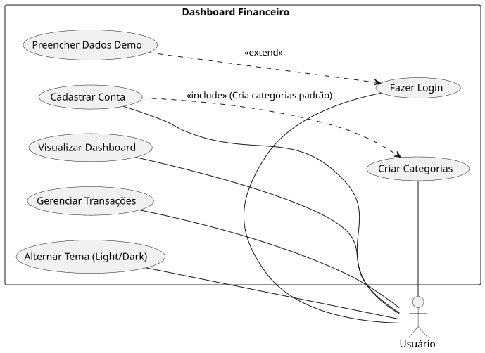

# 📊 Dashboard Financeiro Inteligente

Sistema completo de gestão financeira pessoal com visualização de dados em tempo real, suporte a temas (**Light/Dark**) e persistência de dados em nuvem.

<a href="https://dashboard-financeiro-projeto-pi-web.vercel.app/login" target="_blank">Acessar Dashboard Financeiro</a>


## ⚡ Otimização de Performance (Anti-Cold Start)

Este projeto utiliza o **Neon PostgreSQL**, um banco de dados *serverless* que entra em modo de repouso após períodos de inatividade para otimização de recursos. 

Para garantir uma experiência fluida e sem atrasos para recrutadores e usuários, implementei uma estratégia de **Wake-up Call**:

* **Antecipação de Latência:** Assim que a tela de login é carregada, o frontend dispara uma requisição silenciosa para o endpoint `/api/auth/health`.
* **Aquecimento de Instância:** Essa chamada "acorda" a instância do banco de dados enquanto o usuário ainda está preenchendo suas credenciais, eliminando a percepção de espera no momento do clique.
* **Feedback Visual:** Todos os botões de ação possuem estados de carregamento (*loading states*) para fornecer feedback imediato e evitar múltiplos disparos durante o processamento de dados.

## 🚀 Diferenciais de UX para Recrutadores
Para facilitar a sua avaliação, implementei estratégias que removem barreiras de acesso:

* **Acesso Rápido (Modo Demo):** No login, utilize o botão *"Preencher dados de teste"* para entrar instantaneamente com um perfil preenchido.
* **Semente de Dados Automática:** Ao criar uma conta nova, o sistema gera automaticamente categorias padrão (Alimentação, Salário, Lazer) para que você possa testar os gráficos de imediato.
* **Interface Adaptável:** Suporte completo a Modo Escuro com gráficos que ajustam legendas e eixos dinamicamente.

---

## 🛠️ Tecnologias Utilizadas

### **Frontend**
* **React.js (Vite):** Estrutura de SPA rápida e moderna.
* **Tailwind CSS:** Estilização responsiva e sistema de temas.
* **MUI X Charts:** Visualização de dados avançada com gráficos de pizza e barras.
* **Lucide React:** Conjunto de ícones leves e elegantes.
* **Axios:** Consumo de API.

### **Backend**
* **Node.js & Express:** API REST robusta.
* **JWT (JSON Web Token):** Autenticação segura de usuários.
* **Bcrypt.js:** Criptografia de senhas.
* **Sequelize (ORM):** Gerenciamento e abstração de consultas SQL.

### **Banco de Dados & Infra**
* **PostgreSQL (Neon.tech):** Banco de dados relacional hospedado em nuvem (Serverless).

---

## 📈 Funcionalidades Principais

* **Gestão de Transações:** Fluxo completo de Entradas e Saídas com histórico detalhado.
* **Gerenciamento de Categorias:** Personalização de categorias por usuário com cores e tipos específicos.
* **Análise Visual:** Gráfico de distribuição de despesas por categoria e comparativo de balanço mensal.
* **Cálculo de Saldo Real:** Monitoramento dinâmico de entradas, saídas e saldo total.

---

## 🖼️ Estrutura de Wireframe (Esqueleto da Interface)

A interface foi projetada seguindo princípios de **Hierarchy of Information** (Hierarquia de Informação) e **User Flow** intuitivo.

### **1. Tela de Login / Cadastro**
* **Central Card:** Um contêiner centralizado para foco total no usuário.
* **Campos de Input:** Espaços otimizados para Nome (no registro), E-mail e Senha.
* **Primary Button:** Botão de ação principal com cor sólida para "Entrar" ou "Finalizar Cadastro".
* **Demo Access:** Link destacado para *"Preencher dados de teste"*, reduzindo drasticamente a fricção de entrada para avaliadores.


### **2. Dashboard Principal (Visão Geral)**
* **Sidebar (Esquerda):** Menu vertical contendo ícones de Navegação (Dashboard, Transações, Sair).
* **Header (Topo):** Título da seção e botão de alternância de Tema (**Sun/Moon**).
* **Grid de Cards (Topo):** Três blocos horizontais de leitura rápida:
    * **Saldo Total:** Valor central em destaque.
    * **Entradas:** Indicador visual positivo (verde).
    * **Saídas:** Indicador visual negativo (vermelho).
* **Área de Gráficos (Centro):**
    * *Lado Esquerdo:* Gráfico de Pizza (Donut) para Distribuição de Categorias.
    * *Lado Direito:* Gráfico de Barras para Resumo Mensal (Entradas vs Saídas).


### **3. Gestão de Transações e Categorias**
* **Formulário de Lançamento:** Inputs rápidos para Descrição, Valor, Data e Categoria.
* **Seção Expansível (Categorias):** Box com borda pontilhada contendo input para nova categoria e seletor de tipo.
* **Tabela de Histórico (Rodapé):** Lista detalhada com colunas para Descrição, Categoria, Data, Valor e Ações (Editar/Excluir).


---

## ⚙️ Como rodar o projeto

### **1. Clonar o repositório**
```bash
git clone [https://github.com/seu-usuario/dashboard-financeiro-projeto-pi.git](https://github.com/seu-usuario/dashboard-financeiro-projeto-pi.git)

### **2. Configurar o Backend**

1. Entre na pasta `server`:
   ```bash
   cd server
   ```
 ### **2. Crie um arquivo .env com suas credenciais do Neon PostgreSQL e uma JWT_SECRET.**

### 3. Instale as dependências:
    ```bash
    npm install
    ```
### 4. Inicie o servidor:
    ```bash
    npm run dev

---
# dashboard-financeiro-projeto-pi

# 📄 Documentação do Projeto: Dashboard Financeiro Pessoal

## I. Visão Geral do Projeto

Este projeto visa a criação de um Dashboard Financeiro Pessoal completo para portfólio, focado em demonstrar proficiência em análise de dados, visualização e arquitetura Full Stack.

| Item | Descrição | 
 | ----- | ----- | 
| **Objetivo** | Criar um Dashboard Financeiro Pessoal para portfólio, demonstrando análise de dados, visualização e arquitetura Full Stack. | 
| **Frontend Stack** | React (com Vite), Material UI (MUI) para componentes estruturais, Tailwind CSS para estilização e customização. | 
| **Backend Stack** | Node.js/Express, SQL (a ser definido, ex: PostgreSQL/MySQL), ORM (ex: Sequelize) para abstração do DB. | 
| **Arquitetura Backend** | MVC (Model-View-Controller) com rotas protegidas por JSON Web Tokens (JWT) para autenticação segura. | 

## II. Estrutura de Rotas (Frontend & Backend)

| Rota (URL) | Tipo (HTTP) | Descrição da Rota | Backend Controller | Protegido? |
| :--- | :---: | :--- | :--- | :---: |
| `/api/auth/cadastro` | **POST** | Cria um novo usuário (Usuarios). | `usuarioController.cadastro` | 🔓 Público |
| `/api/auth/login` | **POST** | Autentica e retorna um Token JWT. | `usuarioController.login` | 🔓 Público |
| `/dashboard` | **GET (FE)** | Tela principal, resumo de saldo e fluxo. | *N/A (Frontend Render)* | 🔐 **Protegido** |
| `/transacoes` | **GET (FE)** | Tela de gestão de lançamentos. | *N/A (Frontend Render)* | 🔐 **Protegido** |
| `/api/transacoes` | **CRUD** | Gerenciamento de lançamentos financeiros. | `transacaoController` | 🔐 **Protegido** |
| `/api/categorias` | **GET/POST** | Gestão de categorias de Receita/Despesa. | `categoriaController` | 🔐 **Protegido** |


## III. Backend (Node.js/Express/SQL)

### A. Estrutura de Diretórios

| Diretório | Função | Exemplo de Arquivo Chave | 
 | ----- | ----- | ----- | 
| `server.js` | Inicialização do Servidor, Middlewares globais. | `const app = express();` | 
| `src/config` | Configurações de terceiros. | `db.js` (conexão SQL e ORM) | 
| `src/models` | Mapeamento das tabelas SQL (Schemas ORM). | `Transacao.js`, `Usuario.js` | 
| `src/routes` | Define as URLs e direciona para os Controllers. | `transacaoRoutes.js` | 
| `src/controllers` | Lógica da requisição (recebe req, chama models, envia res). | `usuarioController.js` | 
| `src/middleware` | Funções executadas antes dos Controllers. | `authMiddleware.js` (Verifica JWT) | 
| `.env` | Armazena variáveis sensíveis (porta, credenciais do DB, chave JWT). | `DB_USER=root` | 

### B. Modelos de Dados SQL (Tabelas Principais)

| Tabela | Chave Primária | Relações (Foreign Keys) | Campos Chaves | 
 | ----- | ----- | ----- | ----- | 
| `Usuarios` | `id_usuario` | N/A | `email`, `senha_hash`, `nome` | 
| `Contas` | `id_conta` | `id_usuario` | `nome`, `saldo_inicial` | 
| `Categorias` | `id_categoria` | `id_usuario` | `nome`, `tipo` (Receita/Despesa) | 
| `Transacoes` | `id_transacao` | `id_usuario`, `id_categoria`, `id_conta` | `data`, `valor`, `descricao` | 
| `Orcamentos` | `id_orcamento` | `id_usuario`, `id_categoria` | `mes_ano`, `valor_orcado` | 

## IV. Frontend (React/MUI/Tailwind)

### A. Componentes e Bibliotecas Principais

| Componente | Função | Tecnologia | 
 | ----- | ----- | ----- | 
| Layout | Estrutura principal: Sidebar (Menu), Header. | React, MUI (`Drawer`, `AppBar`) | 
| Autenticação | Telas de Login/Cadastro/Recuperar. | React, Tailwind CSS | 
| Gráficos | Renderização de dados financeiros (linha, pizza). | Recharts ou Chart.js (com wrapper React) | 
| Tabelas | Exibição e filtragem de transações. | MUI (`Table`, `DataGrid`) | 
| Formulários | Adição e edição de transações. | React, MUI (`TextField`, `DatePicker`) | 

### B. Configuração de Estilo (MUI + Tailwind)

1. **Instalação:** Instalar `tailwindcss`, `@mui/material`, `emotion`.

2. **Conflito:** No arquivo principal (ex: `App.jsx`), utilizar o componente `<StyledEngineProvider injectFirst>` do MUI para garantir que as classes Tailwind tenham precedência sobre os estilos padrão do Material UI, permitindo a customização visual.

## 📝 Documentação da API (REST)

O backend segue os princípios RESTful, com rotas protegidas por autenticação via JWT.

### **1. Autenticação (Auth)**

| Método | Endpoint | Descrição | Requisitos |
| :--- | :--- | :--- | :--- |
| **POST** | `/api/auth/register` | Cria um novo usuário e gera 5 categorias iniciais. | `nome`, `email`, `senha` |
| **POST** | `/api/auth/login` | Autentica o usuário e retorna o Token JWT. | `email`, `senha` |

### **2. Transações (Transactions)**

> 🔐 Todas as rotas abaixo exigem o Header `Authorization: Bearer <token>`.

| Método | Endpoint | Descrição |
| :--- | :--- | :--- |
| **GET** | `/api/transacoes` | Retorna todas as transações do usuário logado. |
| **POST** | `/api/transacoes` | Cria uma nova transação (Entrada ou Saída). |
| **PUT** | `/api/transacoes/:id` | Atualiza os dados de uma transação específica. |
| **DELETE** | `/api/transacoes/:id` | Remove uma transação permanentemente. |

### **3. Categorias (Categories)**

| Método | Endpoint | Descrição |
| :--- | :--- | :--- |
| **GET** | `/api/categorias` | Lista as categorias personalizadas do usuário. |
| **POST** | `/api/categorias` | Cria uma nova categoria com nome e tipo (Receita/Despesa). |

---


## 🗄️ Modelagem de Dados (DER)

A estrutura do banco de dados foi projetada para garantir o isolamento total dos dados por usuário e a integridade referencial entre transações e categorias.


### **Dicionário de Dados**

* **Tabela `usuarios`:** Armazena as informações de perfil e credenciais criptografadas (hash) para autenticação segura via JWT.
* **Tabela `categorias`:** Define as classificações financeiras.
    * **Inteligência de Registro:** No momento do cadastro, o sistema executa um `bulkCreate` para gerar categorias padrão (Alimentação, Salário, Lazer) vinculadas ao novo `id_usuario`.
    * **Campo `tipo`:** Atua como um `ENUM` para validar se a categoria pertence ao fluxo de **Receita** ou **Despesa**.
* **Tabela `transacoes`:** O núcleo financeiro do sistema. Armazena valores decimais, datas e descrições, vinculando-se obrigatoriamente a uma categoria e a um usuário.


### **Regras de Negócio e Relacionamentos**

* **Relacionamento 1:N (Usuário ⮕ Transações/Categorias):** Garante que cada usuário visualize apenas seus próprios dados, filtrados rigorosamente pelo `id_usuario` no backend.
* **Relacionamento 1:N (Categoria ⮕ Transações):** Permite a agregação de dados para a geração de inteligência visual (ex: Gráficos de Pizza/Donut).
* **Exclusão em Cascata (ON DELETE CASCADE):** Configurado para que, caso um usuário remova sua conta, todos os registros relacionados sejam apagados automaticamente, garantindo a limpeza do banco **Neon PostgreSQL** e conformidade com privacidade de dados.

---

## 📋 Requisitos Funcionais e Casos de Uso (UML)

O sistema foi modelado para oferecer uma experiência fluida, utilizando padrões de interação que automatizam processos de backend e facilitam o onboarding do usuário.



### **Detalhamento das Funcionalidades**

#### **1. Fluxo de Autenticação e Onboarding**
* **Cadastrar Conta:** Ao realizar o registro, o sistema executa automaticamente a criação de categorias padrão através de uma relação de `<<include>>`, garantindo que o usuário possua estrutura imediata para lançamentos.
* **Fazer Login:** Acesso seguro às rotas protegidas através de validação de **Token JWT** no backend.
* **Preencher Dados Demo:** Funcionalidade de `<<extend>>` no login, projetada estrategicamente para que recrutadores visualizem o dashboard populado instantaneamente, removendo a fricção do cadastro manual.

#### **2. Gestão Financeira e Visualização**
* **Visualizar Dashboard:** Centralização de informações consumindo dados processados pelo **MUI X Charts**, permitindo análise de saldos e distribuições.
* **Gerenciar Transações:** Controle total (**CRUD**) sobre entradas e saídas financeiras para manutenção do histórico pessoal.
* **Criar Categorias:** Além das sementes automáticas, o usuário possui autonomia para personalizar novas categorias de gasto ou receita.

#### **3. Personalização de Interface**
* **Alternar Tema (Light/Dark):** Implementação via `ThemeContext` que permite a mudança global da estética, ajustando dinamicamente as cores dos gráficos e componentes para manter a legibilidade em qualquer modo.