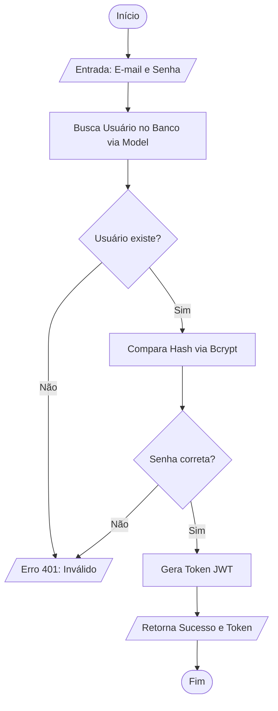

-----

# 📊 Dashboard Financeiro Inteligente

Sistema Full Stack de gestão financeira pessoal com análise de dados em tempo real, arquitetura escalável e foco em **UX Responsiva**.

\<a href="[https://dashboard-financeiro-projeto-pi-web.vercel.app/login](https://dashboard-financeiro-projeto-pi-web.vercel.app/login)" target="\_blank"\>**Acessar Dashboard Financeiro**\</a\>

-----

## ⚡ Diferenciais Técnicos e Performance

### **Otimização Anti-Cold Start (Neon PostgreSQL)**

Como o projeto utiliza banco de dados *serverless*, implementei uma estratégia de **Wake-up Call**:

  * **Antecipação:** O frontend dispara um `health-check` silencioso assim que a tela de login carrega.
  * **Resultado:** O banco de dados "acorda" enquanto o usuário digita as credenciais, eliminando o atraso de conexão no primeiro acesso.

### **Visualização de Dados Evoluída (UX)**

Recentemente, refatorei o motor de visualização de dados para oferecer maior clareza analítica:

  * **Gráficos de Barras Diárias:** Substituímos o gráfico de linha acumulada por barras de frequência diária. Isso permite ao usuário identificar **picos de gastos** específicos em vez de apenas uma progressão constante.
  * **Gráficos Reativos ao Tema:** Utilização de `ThemeProvider` do MUI para que eixos, legendas e tooltips alterem suas cores instantaneamente entre os modos **Light** e **Dark**.
  * **Responsividade Avançada:** Gráficos que reconfiguram seu layout (empilhamento de grids e ajuste de raio de pizza) automaticamente para dispositivos móveis.

-----

## 🛠️ Stack Tecnológica

| Camada | Tecnologias |
| :--- | :--- |
| **Frontend** | React.js (Vite), Tailwind CSS, **MUI X Charts**, Lucide Icons, Context API. |
| **Backend** | Node.js, Express, **JWT** (Autenticação), Bcrypt.js (Segurança). |
| **Database** | **PostgreSQL (Neon.tech)** com Sequelize ORM. |
| **Deploy** | Vercel (Frontend) e Render (Backend). |

-----

## 📈 Funcionalidades Principais

  * **Onboarding Automático:** Ao criar uma conta, o sistema executa um `bulkCreate` de categorias padrão (Alimentação, Salário, Lazer), permitindo uso imediato.
  * **Gestão de Transações:** CRUD completo de entradas e saídas com filtragem por período.
  * **Análise de Balanço:** Comparativo visual entre Entradas vs Saídas e distribuição percentual por categoria.
  * **Segurança:** Senhas protegidas por `Salt` e `Hash` (Bcrypt) e rotas protegidas por middleware de Token JWT.

-----

## 🖼️ Interface e Wireframes

### **1. Dashboard Principal**

Projetado com foco em **Hierarquia de Informação**:

  * **Cards de Resumo:** Saldo total, Entradas e Saídas em destaque no topo.
  * **Gráfico de Picos Diários:** Visualização em barras para identificar dias de maior consumo.
  * **Distribuição de Despesas:** Gráfico de Pizza (Donut) com legendas responsivas.

### **2. Gestão de Transações**

  * **Formulário Inteligente:** Cadastro rápido de transações com seleção de categorias dinâmicas.
  * **Modo Mobile:** Tabela e formulários que se adaptam para evitar rolagem lateral e "esmagamento" de componentes.

-----

## 🏗️ Arquitetura e Fluxo de Dados

O projeto segue o padrão **MVC (Model-View-Controller)** para garantir separação de responsabilidades.

### **Fluxo de Autenticação (Simbologia ISO)**

Abaixo, o mapeamento técnico de como o sistema valida o acesso:

-----

## ⚙️ Configuração Local

1.  **Clonar:** `git clone https://github.com/seu-usuario/projeto.git`
2.  **Backend:** \* `cd server && npm install`
      * Configure o `.env` com `DATABASE_URL` e `JWT_SECRET`.
      * `npm run dev`
3.  **Frontend:**
      * `cd client && npm install`
      * `npm run dev`

-----
